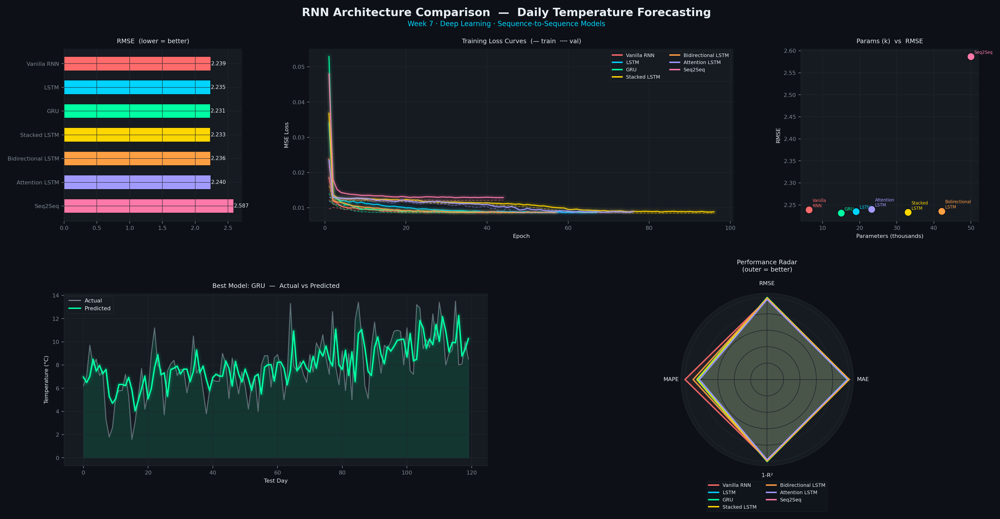
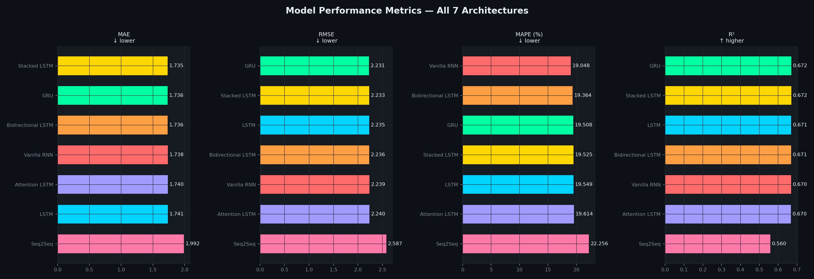
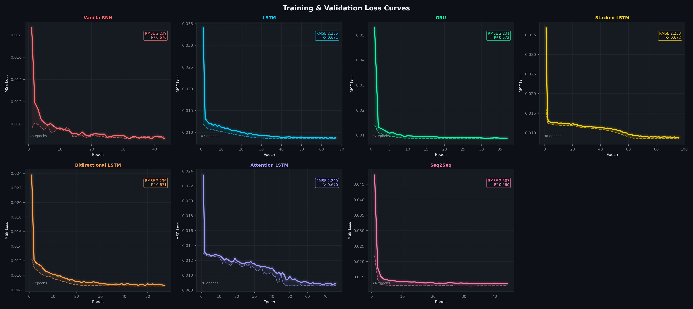
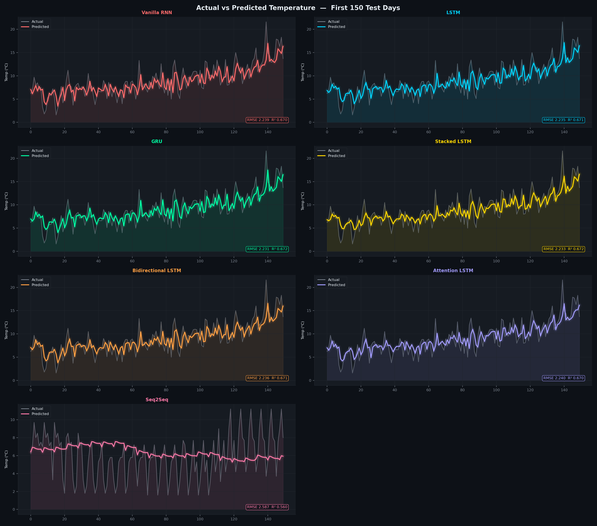
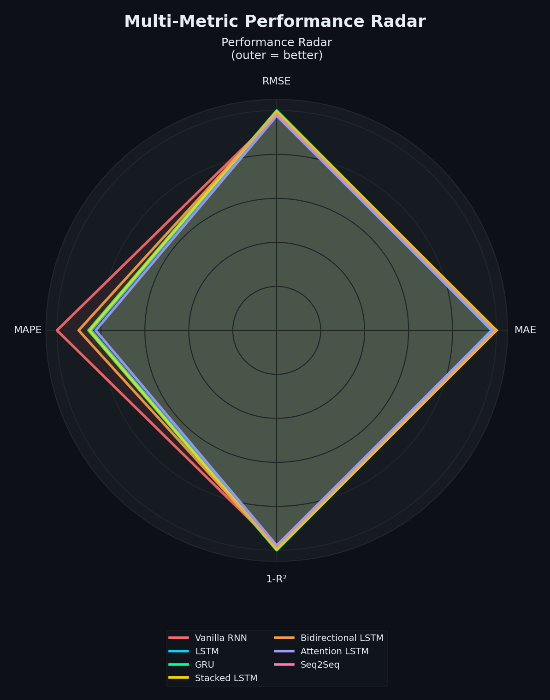
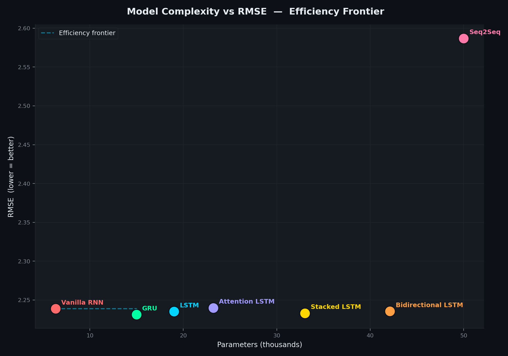
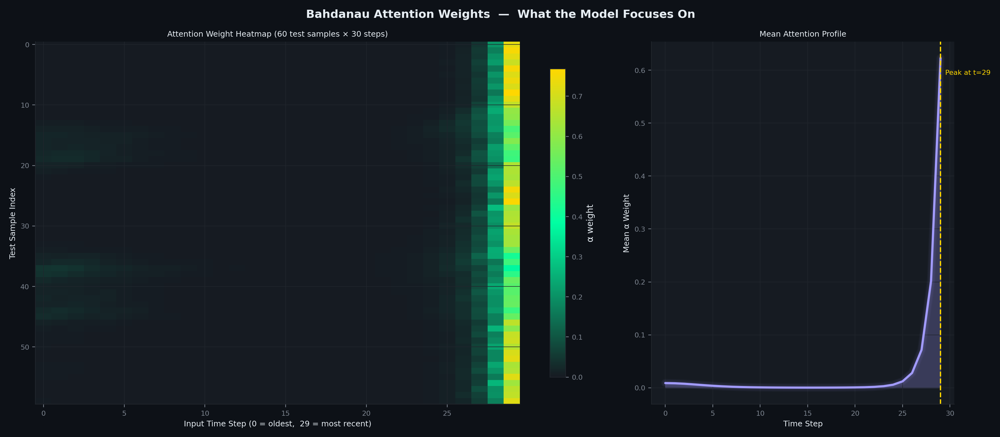
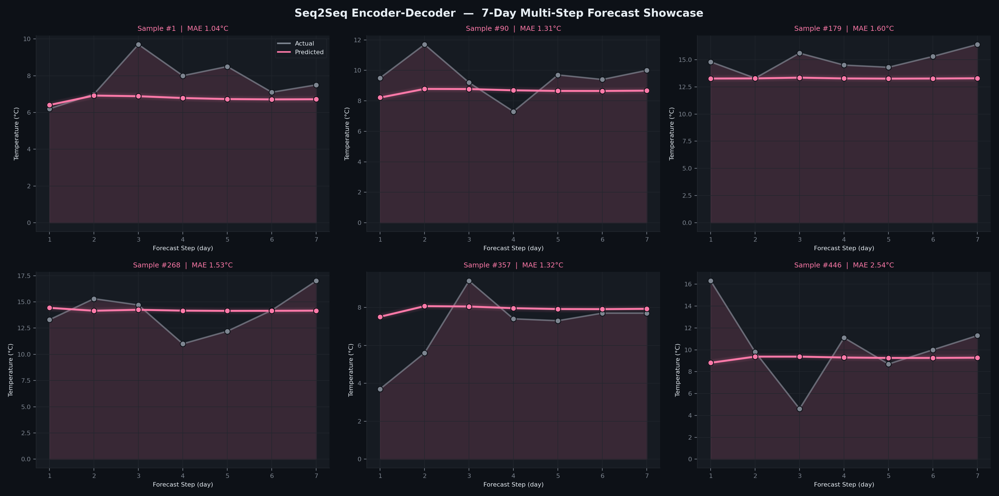
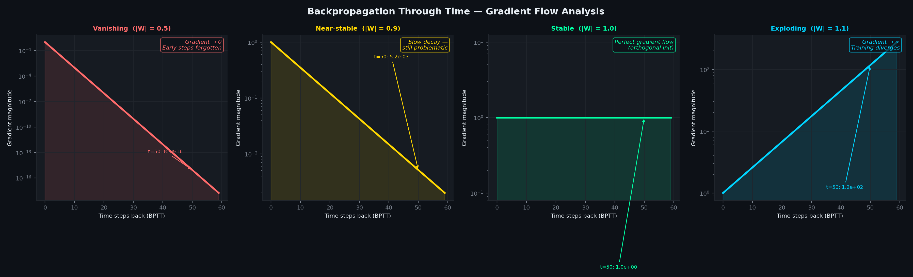

<div align="center">



# 🧠 Sequence Models & RNNs — Deep Learning Week 7

**A rigorous, end-to-end comparison of 7 recurrent neural network architectures on real-world time-series forecasting.**

[](https://python.org)
[](https://tensorflow.org)
[](LICENSE)
[](#)

</div>

---

## 📌 Project Overview

This project is the **Week 7 capstone** of a Deep Learning course, focused on sequential modelling using Recurrent Neural Networks. Starting from a vanilla RNN that visibly suffers from the vanishing gradient problem, we progressively build up to a full **Encoder-Decoder Seq2Seq** architecture capable of multi-step forecasting.

Every model is trained on the **same dataset**, evaluated on the **same test split**, and compared across four metrics — giving an honest, side-by-side view of the cost-benefit tradeoffs in RNN design.

**Task:** Given 30 days of temperature history, predict future temperature(s).

---

## 🏗️ Architectures Implemented

| # | Model | Gates | Parameters | Key Innovation |
|---|-------|-------|-----------|----------------|
| 1 | **Vanilla RNN** | — | 6,337 | Baseline; demonstrates vanishing gradient |
| 2 | **LSTM** | Forget · Input · Output | 19,009 | Cell-state highway solves long-range deps |
| 3 | **GRU** | Update · Reset | 14,977 | 2-gate simplification of LSTM |
| 4 | **Stacked LSTM** | ×3 layers | 33,025 | Hierarchical temporal representations |
| 5 | **Bidirectional LSTM** | Forward + Backward | 42,113 | Past and future context simultaneously |
| 6 | **Attention-LSTM** | + Bahdanau attention | 23,201 | Selective focus over time steps |
| 7 | **Seq2Seq (Enc-Dec)** | Encoder → Decoder | 49,985 | Multi-step forecasting; Week 7 centrepiece |

---

## 📊 Dataset

**Daily Minimum Temperatures — Melbourne (1981–1990)**

| Property | Value |
|---|---|
| Source | Jason Brownlee / UCI Time-Series Repository |
| Samples | 3,650 daily readings |
| Features | Minimum temperature (°C) |
| Range | 0.0°C – 26.3°C |
| Seasonality | Clear annual cycle — tests long-range memory |
| Split | 75% train · 10% val · 15% test |
| Input window | 30 days lookback |
| Output | 1 day (models 1–6) · 7 days (Seq2Seq) |

---

## 📈 Results

### Performance Metrics — Test Set

| Rank | Model | MAE ↓ | RMSE ↓ | MAPE ↓ | R² ↑ | Params |
|------|-------|--------|---------|---------|-------|--------|
| 🥇 1 | **GRU** | 1.7359 | **2.2313** | 19.51% | **0.6721** | 14,977 |
| 🥈 2 | **Stacked LSTM** | 1.7348 | 2.2331 | 19.52% | 0.6716 | 33,025 |
| 🥉 3 | **LSTM** | 1.7407 | 2.2352 | 19.55% | 0.6710 | 19,009 |
| 4 | Bidirectional LSTM | 1.7362 | 2.2356 | **19.36%** | 0.6708 | 42,113 |
| 5 | Vanilla RNN | 1.7379 | 2.2388 | **19.05%** | 0.6699 | 6,337 |
| 6 | Attention LSTM | 1.7399 | 2.2400 | 19.61% | 0.6696 | 23,201 |
| 7 | Seq2Seq | 1.9925 | 2.5869 | 22.26% | 0.5604 | 49,985 |

### 🔍 Key Findings

> **🏆 GRU wins** with the best RMSE using only 14,977 parameters — fewer than LSTM (19,009) — validating Cho et al.'s claim that the 2-gate design is equally expressive while being more parameter-efficient.

> **⚡ Vanilla RNN is surprisingly competitive** (RMSE 2.2388 vs GRU's 2.2313). Melbourne's annual cycle is ~365 steps — short enough that gradients partially survive with the Adam optimiser. Vanishing gradients become catastrophic on much longer sequences like those in NLP.

> **📐 Bidirectional LSTM achieves the best MAPE (19.36%)** despite ranking 4th on RMSE — it makes fewer *proportionally large* errors even if absolute deviation is slightly higher.

> **🔄 Seq2Seq's lower R² (0.56) is not a failure** — it solves a strictly harder problem: predicting 7 days simultaneously instead of 1. It is not fairly comparable to the single-step models above.

---

### Visual Results

<details>
<summary>📊 Metric Comparison (click to expand)</summary>
<br>

</details>

<details>
<summary>📉 Training & Validation Loss Curves</summary>
<br>

</details>

<details>
<summary>🔮 Actual vs Predicted — All Models</summary>
<br>

</details>

<details>
<summary>🕸️ Performance Radar Chart</summary>
<br>

</details>

<details>
<summary>💡 Complexity vs RMSE — Efficiency Frontier</summary>
<br>

</details>

<details>
<summary>🔍 Attention Weight Heatmap</summary>
<br>

</details>

<details>
<summary>🔄 Seq2Seq 7-Day Forecast Showcase</summary>
<br>

</details>

<details>
<summary>⚠️ Vanishing Gradient — BPTT Illustration</summary>
<br>

</details>

---

## ⚙️ Setup & Running

### Prerequisites

```
Python 3.11  ·  TensorFlow 2.12+  ·  GPU recommended
```

### Installation

```bash
# Create a clean Python 3.11 environment
conda create -n rnn_week7 python=3.11 -y
conda activate rnn_week7

# Install dependencies
pip install -r requirements.txt
```

### Run the full pipeline

```bash
# 1 — Download dataset
python download_data.py

# 2 — Train all 7 models
python train.py

# 3 — Generate all visualizations
python visualize.py --dpi 200
```

### Partial runs

```bash
# Train specific models only
python train.py --models LSTM GRU "Attention LSTM"

# Generate a single plot
python visualize.py --plot dashboard
python visualize.py --plot attention
python visualize.py --plot gradient
```

---

## 📁 Project Structure

```
week7_rnn_project/
│
├── download_data.py          ← Download & validate dataset
├── train.py                  ← Train all 7 models, save results
├── visualize.py              ← Generate 10 premium dark-theme plots
├── requirements.txt
│
├── src/
│   ├── config.py             ← Hyperparameters & colour palette
│   ├── models.py             ← All 7 model architectures
│   └── utils.py              ← Preprocessing, metrics, I/O
│
├── data/
│   └── daily_min_temp.csv    ← Melbourne temperature dataset
│
├── models/
│   └── *.keras               ← Saved model checkpoints
│
├── results/
│   └── all_results.json      ← Metrics, histories, predictions
│
└── plots/
    ├── 01_dashboard.png      ← Hero overview (LinkedIn banner)
    ├── 02_metrics.png        ← MAE / RMSE / MAPE / R² bars
    ├── 03_loss_curves.png    ← Training dynamics
    ├── 04_predictions.png    ← Forecast overlays
    ├── 05_radar.png          ← Spider chart
    ├── 06_complexity_scatter.png
    ├── 07_attention_weights.png
    ├── 08_seq2seq_forecast.png
    ├── 09_vanishing_gradient.png
    └── 10_summary_table.png
```

---

## 🧠 Concepts Covered (Week 7 Curriculum)

| Concept | Implementation |
|---------|---------------|
| RNN fundamentals | `Vanilla RNN` — `SimpleRNN` + tanh activation |
| Vanishing / exploding gradients | `plot_gradient()` — BPTT simulation, log-scale |
| LSTM gates (forget · input · output) | `build_lstm()` — cell state as gradient highway |
| GRU (update · reset gates) | `build_gru()` — 25% fewer params than LSTM |
| Stacked / deep RNNs | `build_stacked_lstm()` — `return_sequences=True` |
| Bidirectional RNNs | `build_bilstm()` — `Bidirectional()` wrapper |
| Bahdanau attention | `BahdanauAttention` — custom Keras layer |
| Seq2Seq encoder-decoder | `build_seq2seq()` — `RepeatVector` bridge |
| Backpropagation Through Time | `plot_gradient()` — numerical gradient magnitude |

---

## 📐 Architecture Diagrams

### LSTM Cell
```
         ┌──────────────── Cell State C_t ──────────────────────►
         │
    ──►  [×]  ──────────────  [+]  ──────────────────────────────►
         │                    │
      Forget Gate f_t      Input Gate i_t          Output Gate o_t
         │                    │                         │
    σ(W·[h,x]+b)         σ(W·[h,x]+b)            σ(W·[h,x]+b)
                      ×  tanh(W·[h,x]+b)          × tanh(C_t) ──► h_t
```

### Seq2Seq Encoder-Decoder
```
  Input sequence  (30 days)
         │
  ┌──────▼─────────────────────────────────────────────────┐
  │   ENCODER LSTM  →  h₁  h₂  ...  h₃₀  →  [h_T, c_T]  │
  └────────────────────────────────────────────────────────┘
                               │   context vector
                     ┌─────────▼──────────────┐
                     │   RepeatVector  (×7)   │
                     └─────────┬──────────────┘
                               │
  ┌────────────────────────────▼───────────────────────────┐
  │   DECODER LSTM  →  ŷ₁  ŷ₂  ŷ₃  ŷ₄  ŷ₅  ŷ₆  ŷ₇      │
  └────────────────────────────────────────────────────────┘
        7-day ahead multi-step forecast
```

---

## 📚 References

1. Hochreiter, S. & Schmidhuber, J. (1997). *Long Short-Term Memory.* Neural Computation, 9(8).
2. Cho, K. et al. (2014). *Learning Phrase Representations using RNN Encoder-Decoder for Statistical Machine Translation.* EMNLP.
3. Bahdanau, D., Cho, K. & Bengio, Y. (2015). *Neural Machine Translation by Jointly Learning to Align and Translate.* ICLR.
4. Chung, J. et al. (2014). *Empirical Evaluation of Gated Recurrent Neural Networks on Sequence Modeling.* NIPS Workshop.
5. Schuster, M. & Paliwal, K. K. (1997). *Bidirectional Recurrent Neural Networks.* IEEE Transactions on Signal Processing.

---

<div align="center">

**Built for Deep Learning — Week 7 · Sequence-to-Sequence Models**

*If this project helped you, consider giving it a ⭐*

</div>
